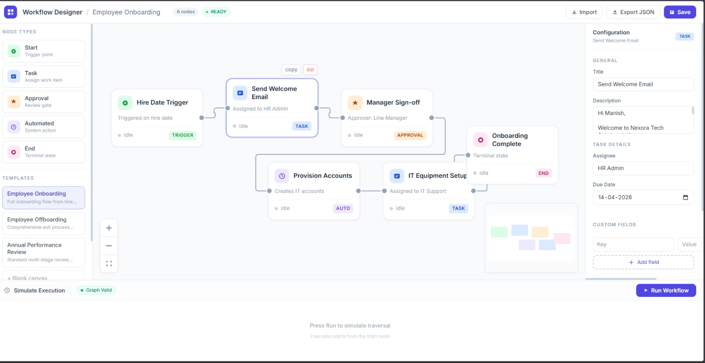
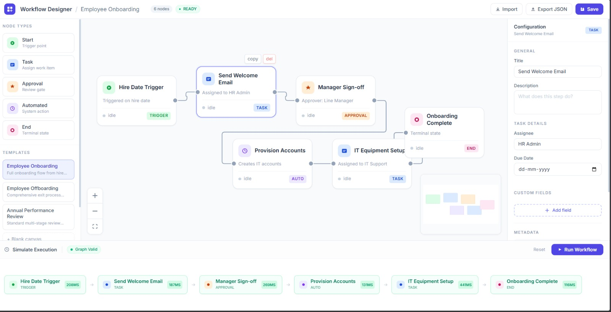

# HR Workflow Designer
##  Preview

### Canvas


### Simulation


A production-grade, schema-driven workflow orchestration module built with React, React Flow, and Zustand. This application allows HR administrators to design, validate, and simulate complex operational workflows with real-time feedback and graph-based execution.


##  Features

- **Advanced Graph Canvas**: Drag-and-drop node creation, interactive connections, and a mini-map for navigation.
- **Strict Validation Engine**: Real-time graph analysis ensuring exactly one Start node, reachability from terminal points, and cycle detection.
- **Graph-Based Simulation**: Deterministic execution simulation using BFS traversal starting from the trigger point.
- **Schema-Driven Automation**: Dynamic configuration forms for automated steps, powered by a flexible metadata service.
- **Persistence**: Export and Import workflows as JSON for portability and storage.
- **Professional UX**: Premium aesthetics with status indicators, responsive panels, and smooth animations.

## 🛠Tech Stack

- **Framework**: React 18 (Vite)
- **Styling**: Tailwind CSS (Vanilla CSS for custom animations)
- **Flow Engine**: React Flow
- **State Management**: Zustand
- **Utility**: Nanoid (ID generation)
- **Language**: TypeScript (Strict mode)

##  Architecture & Design

### State Management (Zustand)
The application follows a unidirectional data flow pattern. The `workflowStore` serves as the single source of truth for nodes, edges, selection state, and validation status. Every mutation to the canvas (moving, connecting, deleting) triggers a debounced validation cycle.

### Graph Execution Logic
Unlike simple UI-order heuristics, this system treats the workflow as a true Directed Acyclic Graph (DAG) during simulation:
1. **Traversal**: A BFS (Breadth-First Search) algorithm identifies the order of execution starting from the `start` node.
2. **Cycle Prevention**: The execution engine uses a `visited` set to detect and safely exit from unintentional loops.
3. **Simulation**: Execution is simulated step-by-step with status updates (`idle` → `running` → `success`) visible on the canvas.

### Validation Strategy
The `validateWorkflow` utility enforces production constraints:
- **Topology**: Checks for disconnected subgraphs and unreachable nodes.
- **Constraints**: Ensures the `start` node has no incoming edges and at least one `end` node exists.
- **Integrity**: Flags dangling edges and missing node references.
- **Visual Feedback**: Errors are mapped back to specific `nodeIds`, allowing the UI to highlight invalid components with high precision.

### Extensible Forms
Automation nodes are refactored to be schema-driven. Adding a new automation action (e.g., "Slack Notification") only requires:
1. Adding a schema to the `getActionSchemas` API response.
2. The `ConfigPanel` will automatically render the appropriate inputs (text, select, textarea) based on the metadata.

##  Setup Instructions

### Prerequisites
- Node.js (v16+)
- npm or yarn

### Installation
```bash
# Install dependencies
npm install

# Start the development server
npm run dev
```

The application will be available at `http://localhost:5173`.

##  Trade-offs & Assumptions

- **Cycle Handling**: For this version, cyclic graphs are marked as "Invalid" to enforce deterministic HR flows. In future iterations, loops could be supported with explicit "Maximum Iteration" configs.
- **Mock Persistence**: State is maintained in-memory and lost on refresh. JSON Export/Import is the primary way to persist designs for now.
- **Simulation Time**: Artificial delays are added to simulation steps to improve visual tracking of the execution flow.

---

###  API Layer

#### GET /automations
Returns available automated actions with dynamic param schemas:
```json
[
  { "id": "send_email",    "label": "Send Email",         "params": ["to", "subject", "body"] },
  { "id": "generate_doc",  "label": "Generate Document",  "params": ["template", "recipient"] },
  { "id": "update_record", "label": "Update HR Record",   "params": ["field", "value"] },
  { "id": "webhook",       "label": "Trigger Webhook",    "params": ["url", "method"] },
  { "id": "slack_notify",  "label": "Slack Notification", "params": ["channel", "message"] }
]
```

#### POST /simulate
Accepts serialized workflow JSON, returns step-by-step execution result:
```json
{
  "workflowId": "wf-onboarding",
  "status": "success",
  "steps": [
    { "nodeId": "n1", "nodeLabel": "Hire Date Trigger", "status": "success", "duration": 134 }
  ],
  "totalDuration": 891
}
```

###  Completed vs. What I'd Add Next

#### Completed
- All 5 custom node types with full TypeScript interfaces (strict mode)
- Dynamic config forms per node type with field validation
- Start + Task nodes: key-value custom fields editor
- End Node: endMessage field + summaryFlag boolean toggle
- Automated Node: fetches actions from GET /automations, renders param fields dynamically based on API response
- Zustand store with BFS-based graph execution simulation
- Cycle detection + topology validation (disconnected nodes, missing start/end)
- Mock API layer with simulated network delay (300ms)
- Export / Import workflow as JSON
- MiniMap, zoom controls, 3 pre-built templates

#### Would add with more time
- Undo/Redo via Zustand middleware or immer patches
- Auto-layout using Dagre algorithm
- Conditional branch / decision node type
- Visual error badges rendered directly on invalid nodes on the canvas
- localStorage persistence between sessions
- Unit tests with Jest + React Testing Library
- Node version history / audit trail
